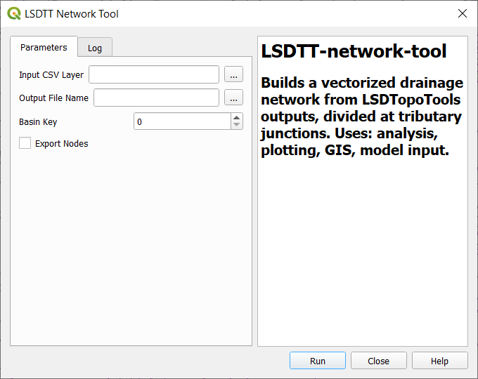

# LSDTT-network-tool QGIS Plugin
Builds a vectorized drainage network from LSDTopoTools outputs, divided at tributary junctions. Uses: analysis, plotting, GIS, model input.



## Introduction

The QGIS LSDTT Network Tool is a QGIS interface for lsdtt-network-tool.py. This guide assumes you have the proper inputs for the tool. For more detailed documentation and instructions of lsdtt-network-tool.py, visit [the lsdtt-network-tool GitHub repository](https://github.com/MNiMORPH/LSDTT-network-tool).

lsdtt-network-tool creates a geopackage containing a channel network made of line segments from the points outputted by the chi-mapping tool. In other words, it creates a network of lines that show the channels generated during the chi mapping. These lines can be easily imported into your favorite GIS software. 

## Guide

### Part 1: Using The `lsdtt-chi-mapping` Tool: Extracting Channels From Your DEM 
LSDTopoTools is a program with many tools that are able to extract a range of data from DEMs. The `lsdtt-chi-mapping` tool can be used to create channel networks and record various parameters along each channel, such as elevation, flow distance, drainage area, chi, and more. 

#### Inputs
* A digital elevation model (DEM) in the the ENVI .bil format of your area of interest.
  * If you have a DEM in a different format, you can use `gdal_tranlate` with the flag `-of ENVI` to convert to the correct format.  
* A parameter file
  * We will go through what needs to be included in this file. It must be a plain text file (not a word or google document).

#### Outputs
* _Neccesary outputs_
  * *_MChiSegmented.csv
  * *_chi_data_map.csv
* _Optional outputs_
  * *_hs.bil (this one prints a hillshade raster and is nice for making good looking figures!)
  * There are many other outputs possible,and which outputs you get will depend on what you include in your parameter file. A complete list can be found in the [LSDTopoTools User Guide to Chi Analysis](https://lsdtopotools.github.io/LSDTT_documentation/LSDTT_chi_analysis.html). 

#### Workflow

##### Step 1: Fill nulls in your your DEM #####
* There are many ways to do this, but we will suggest two: the  the 'Fill nodata' tool in the GDAL package of qgis and the 'r.fillnulls' tool in the Grass package of qgis.  

##### Step 2: Write a parameter file #####
* In order to write this file you will need to be able to edit a plain text file, which requires a code editor. There are many programs out there that do this, but Visual Studio Code and Sublime are two popular options. 
* Each parameter file is unique to the project you are working on because it is the instructions you are giving the computer. Variations should be made depending on the contents of your DEM and what outputs you are interested in obtaining. Regardless of the content and goals for your project, the first few lines of your parameter file should include the location and naming information for the input and output files. All parameter files need these lines. For our example, the first few lines look like:
```
read path: /home/josie/LSDTopoTools/Northshore_Data/CascadeRiver
write path: /home/josie/LSDTopoTools/Northshore_Data/CascadeRiver
read fname: CascadeRiver
write fname: CascadeRiver

channel heads fname: NULL
```
* As you can see, we have a read path and a write path, which tell the computer where to find the files that we want it to use, the read filename (`read fname`), which is the prefix that we want the computer look for at the beginning input file names and the write filename (`write fname`) which is the prefix we want the computer to attach to the beginning of the name of all output files. Below those, there is a line indicating whether the computer should look for a channel heads location file. If you have one write the file name (include the full path to the file if the file is not in the same location as the DEM and parameter file). If you do not have one, inclulde the line and write NULL. 

* Next, include information about how the computer will process the input data. For our example, this looks like:
```
# Parameter for filling the DEM 
min_slope_for_fill: 0.0001

# Parameters for selecting channels and basins
threshold_contributing_pixels: 10000
minimum_basin_size_pixels: 100000
maximum_basin_size_pixels: 6000000
test_drainage_boundaries: false
# Use network tool to select largest complete basin via "--basin_key"
find_largest_complete_basins: false
find_complete_basins_in_window: false

# The data that you want printed to file
write_hillshade: true
print_basin_raster: false
print_chi_data_maps: true
print_basic_M_chi_map_to_csv: false
print_segmented_M_chi_map_to_csv: true
use_extended_channel_data: true

# Chi analysis options
m_over_n: 0.5
A_0: 1

```
* First is a parameter that is used for filling the DEM. Next, there is a series of parameters that the computer will use to select basins and locate channels. Adjusting these will affect the size of basins and the starting locations of rivers. In this example, we are using area-threshold extraction, but there are a number of algorithms available in this program to extract basins and channels. If you are interested in more information about what they are and how to use them, visit the [LSDTopoTools documentation page](https://lsdtopotools.github.io/LSDTT_documentation/). Then there are some instructions to tell the computer what data we want it to print. For creating long profiles, you must include `print_chi_data_maps: true`, `print_segmented_M_chi_map_to_csv: true`, and  `use_extended_channel_data: true`. Finally, there are some parameters for the chi analysis. 
 
* Save the parameter with a helpful name followed by `.param` in the same folder as your DEM. For our example, the parameter file was named `LSDTT_Chi_Analysis.param`. Now that we have a parameter file, we can actually process the data. 

##### Step 3: Navigate to the directory that contains your DEM and your parameter file #####
* This simplifies the command you write greatly, because you do not have to include the full path to the parameter file.

##### Step 4: Ask the computer to run the lsdtt-chi-mapping tool on your data #####
* Now that you are in the right folder, this is the easy part. Type the command (the $ is the prompt, so don't type that part): 
```
$ lsdtt-chi-mapping name-of-you-parameter-file
```
* For our example, the command looked like:
```
$ lsdtt-chi-mapping LSDTT_chi_analysis.param
```
* This will probably take a bit of time. Running our example data (~110 Mb) on our relatively powerful lab computer (which has 4 to 6 times more horsepower than a most laptops) takes a few minutes. If all goes well, then its time to move on to getting this data cleaned up to make nice plots!

### Inputs
_Necessary inputs:_

* `Input CSV Layer`: The *_MChiSegmented.csv output from LSDTT2

* `Output File Name`: The filename for the output geopackage


_Optional inputs:_

* `Basin Key`: select a single basin for which to generate a network. If the `--basin_key` flag is not used, then all channels generated during chi-mapping will be included in the geopackage.
  * This step is optional, but if you are trying to highlight the network in one basin it is very helpful to pick a basin **before** you print geopackages. Processing will also go quicker if you do this. 
  * To find which basin we want to print, we must look at the channels that we extracted. To do this: 
    1. Open qgis and import *_MChiSegmented.csv
    2. In the geoprocessing toolbox, find the 'Create points layer from table' tool and double click
        - In the 'Input layer' box, select your csv
        - In the 'X field' box, select longitude
        - In the 'Y field' box, select lattitude
        - Make sure the 'target CRS' box says 'ESPG:4326: WGS 84'
        - Leave the rest as it is and run the tool
        - Using the 'identify features' tool click on a channel that you are interested in. In the identify results box on the right, you will find the 'basin_key' for that channels network. 

  * `Export Nodes`: adding this flag tells the program to export all nodes (in addition to all line segments) to a geopackage. **Including this flag is necessary if you are to use lsdtt-channel-plotter.py.**


### Outputs

Output files will be saved in the location given by `Output File Location` and will be automatically added as vector layers to the current QGIS map.

* file_output.gpkg

* file_output_nodes.gpkg (only with use of `-n` / `--node_export` flag)